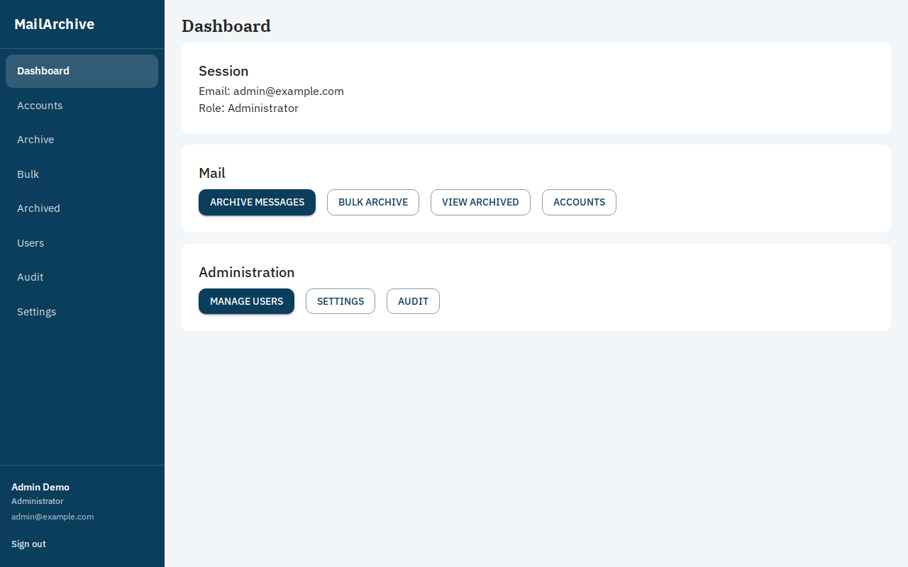
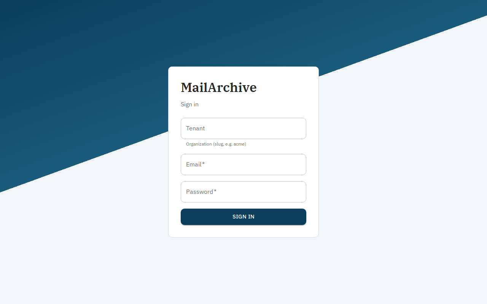
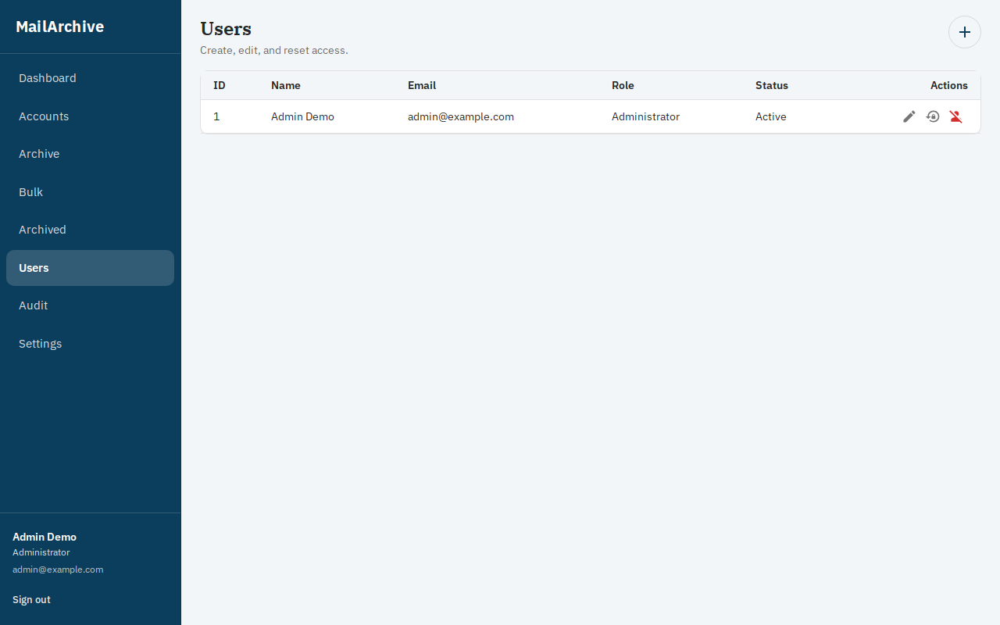
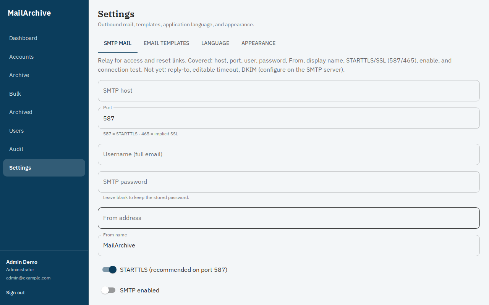
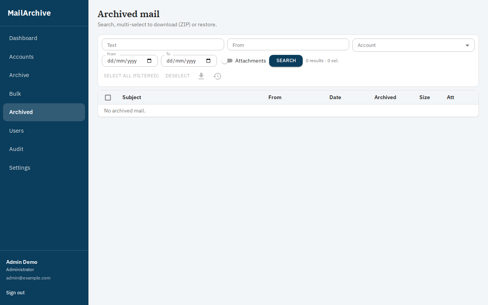
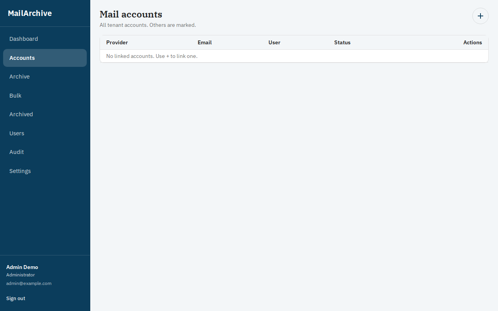

# MailArchive

[](./LICENSE)
[](./docker-compose.yml)
[](./backend/requirements.txt)
[](./frontend/package.json)



> Open source self-hosted email archiving platform for organizations.

MailArchive helps you **retain searchable email history**, free mailbox quota, and keep full control of your data — without expensive proprietary archives or cloud lock-in.

**Docs:** [User manual (EN)](./docs/USER_MANUAL.md) · [Manual de usuario (ES)](./docs/MANUAL_USUARIO.md) · [TODO](./docs/TODO.md) · [Backup](./docs/BACKUP.md) · [Contributing](./CONTRIBUTING.md) · [Changelog](./CHANGELOG.md)

---

## Why MailArchive?

Many organizations need to retain email history but do not want expensive proprietary archive solutions or cloud lock-in.

MailArchive provides:

- Full control of your data (self-hosted)
- Searchable archive stored as open **EML** files (no PST dependency)
- Microsoft 365 and IMAP integration today
- Multi-user RBAC and audit trail
- Open source transparency (MIT)

---

## Screenshots

| Login | Dashboard |
|------|-----------|
|  |  |

| Users | Settings |
|------|----------|
|  |  |

| Archived search | Accounts |
|-----------------|----------|
|  |  |

---

## Features

- Clean Architecture (API / use cases / domain / infrastructure)
- Multi-tenant ready (`tenant_id` from day one; install v1 = one organization)
- Internal RBAC: Admin, Supervisor, User, Read-only
- Providers behind a `MailProvider` interface (Microsoft Graph via HTTP, IMAP)
- **No PST dependency** — archives are stored as open EML files plus attachments and metadata
- Gmail support planned
- Public self-register **off** by default (`FEATURE_PUBLIC_REGISTER=false`)
- Rate limiting on login / register / install
- App-wide language packs (UI + email templates); ES/EN included
- Editable invite / reset email templates with placeholder help

## Supported

- Docker on Linux hosts
- Microsoft 365 / Exchange Online (Graph OAuth)
- Generic IMAP servers
- SQLite (demo / small installs) and MySQL (production profile)

## Security / secrets

> Never commit secrets (`.env`, tokens, passwords, certificates, dumps).

1. Copy `.env.example` → `.env` and fill in local values.
2. `.env` is gitignored — **do not commit it**.
3. Never commit Microsoft credentials, IMAP/SMTP/MySQL passwords, PEM keys, or SQL dumps.
4. If a secret leaks: rotate it immediately.

See [SECURITY.md](./SECURITY.md).

## Quick start (Docker)

```bash
cp .env.example .env   # set SECRET_KEY, JWT, Fernet, etc.
docker compose up --build
# UI:  http://localhost:8080
# API: http://localhost:18100/health
```

Optional MySQL: `docker compose --profile mysql up --build` and set `DB_ENGINE=mysql` in `.env`.

## Development

```bash
# Backend
cd backend
source .venv/bin/activate   # uv venv .venv --python 3.12
export PYTHONPATH=$PWD
uvicorn app.main:app --host 0.0.0.0 --port 18100

# Frontend
cd frontend
npm install
npm run dev   # http://localhost:5175
```

On startup the API runs Alembic migrations and creates any missing tables.

API smoke test: `bash scripts/test_phase0.sh http://127.0.0.1:18100`

## Stack

| Layer | Technologies |
|------|-------------|
| Backend | Python 3.11+, FastAPI, SQLAlchemy, Alembic, MySQL/SQLite, JWT, Pydantic |
| Providers | Microsoft Graph (HTTP/`httpx`), IMAPClient |
| Frontend | React, Vite, TypeScript, Material UI, React Router, Axios |
| Storage | Local filesystem (`mail.eml` + `adjuntos/` + `metadata.json`, SHA-256) |

## Layout

```
backend/     FastAPI + Clean Architecture
frontend/    React + Vite
storage/     Local data (gitignored)
docs/        Manuals, release checklist, screenshots
deploy/      systemd / nginx examples
```

## Roadmap

### v1.0

- [x] Microsoft 365 archive / restore
- [x] IMAP archive / restore
- [x] Docker deployment (API + UI)
- [x] Multi-language (ES/EN) UI + email packs
- [x] Editable SMTP templates
- [ ] Full-text search (beyond basic filters)
- [ ] CI, CONTRIBUTING, CHANGELOG for public release
- [ ] Backup / upgrade documentation

See the full [release checklist](./docs/RELEASE_CHECKLIST.md).

### v1.1

- Gmail support planned
- S3 / object storage option
- Advanced reports / dashboard metrics
- Durable background worker for archive jobs

### Future

- LDAP / Active Directory
- Legal retention policies
- Multiple storage backends
- Tenant branding (logo / colors)

## License

[MIT](./LICENSE)

## Support

If MailArchive helps your organization, consider supporting development.

☕ Ko-fi: <https://ko-fi.com/YOUR_USERNAME>

Your support helps maintain documentation, hosting, and new features.

---

**Español:** este README está en inglés a propósito (público / GitHub). Manual de uso: [docs/MANUAL_USUARIO.md](./docs/MANUAL_USUARIO.md). Checklist de release: [docs/RELEASE_CHECKLIST.md](./docs/RELEASE_CHECKLIST.md).
