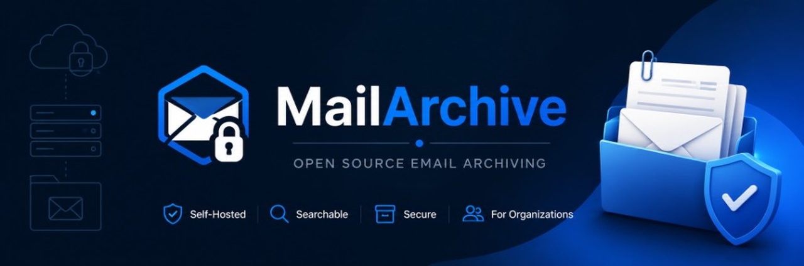

# MailArchive

[](./LICENSE)
[](./docker-compose.yml)
[](./backend/requirements.txt)
[](./frontend/package.json)
[](https://ko-fi.com/F6V224JUWU)

<p align="center">
  
</p>

**Self-hosted email archive that centralizes organizational email in one searchable place.**

MailArchive keeps a local, searchable copy of your organization's email — across Microsoft 365 and IMAP mailboxes — with storage and access under your control. Open source (MIT). No proprietary archive lock-in. No PST dependency.

**Docs:** [User manual (EN)](./docs/USER_MANUAL.md) · [Manual de usuario (ES)](./docs/MANUAL_USUARIO.md) · [TODO](./docs/TODO.md) · [Backup](./docs/BACKUP.md) · [Contributing](./CONTRIBUTING.md) · [Changelog](./CHANGELOG.md)

**Landing:** [redmanxp.github.io/MailArchive-OSS](https://redmanxp.github.io/MailArchive-OSS/) (Vite + Tailwind · GitHub Pages)

---

## Why MailArchive?

Email is a critical business record. Provider quotas, account changes, employee turnover, or accidental deletion should not mean losing years of communication.

MailArchive gives your organization a **central archive** you host and govern: search it, restore it, and keep copies independently of the original mailbox provider.

---

## Features

### Multi-account archiving

- Microsoft 365 / Exchange Online (Graph OAuth)
- Generic IMAP servers
- Multiple mailboxes in one centralized archive

### Fast search

- Full-text search over archived messages
- Browse history without depending on the live provider mailbox
- Download EML or ZIP; restore messages back to the provider

### Role-based access

- **Admin / Supervisor** — manage the organization archive and oversee all mailboxes
- **User** — archive and access their own linked accounts
- **Read-only** — consult without changing data
- Audit trail of sensitive actions

### Open storage & export

- Messages stored as standard **EML** + attachments + metadata (SHA-256)
- **CAS** shared blobs (identical EML/attachments occupy one copy per tenant; refcount on delete)
- Local filesystem or **S3-compatible** object storage (MinIO, AWS S3, R2, Wasabi, …)
- Branding assets stay on disk; mail objects can live in the bucket
- **Export** mailboxes as EML / ZIP — independent from the email provider (no PST lock-in)
- **Restore** to the original mailbox or **another linked account** (cross-account always keeps the archive copy)

### Mailbox protection

- Keep a searchable local copy (optional **keep copy** on restore)
- Ease quota pressure by archiving older mail from the provider
- Preserve history when people leave or providers change

---

## Common use cases

- Build an **internal searchable email repository** for the organization
- **Centralize** Microsoft 365 and IMAP mailboxes in one place
- Archive **former employee** mailboxes before deprovisioning
- Keep **historical communications** after account or tenant changes
- **Export** an archive in standard EML format, independent of the provider
- **Reduce mailbox usage** / free quota on Microsoft 365 or IMAP servers
- Restore selected messages to the original mailbox or another linked account, optionally keeping the local copy
- **Employee departure**: archive a leaving employee's mailbox and keep it searchable for admins
- **Transfer** linked mailboxes between users (admin) when people change roles

---

## Screenshots

| Login | Dashboard |
|------|-----------|
|  |  |

| Users | Settings |
|------|----------|
|  |  |

| Archived search | Accounts |
|-----------------|----------|
|  |  |

---

## Technical highlights

- Clean Architecture (API / use cases / domain / infrastructure)
- Multi-tenant ready (`tenant_id` from day one; install v1 = one organization)
- Providers behind a `MailProvider` interface
- Public self-register **off** by default (`FEATURE_PUBLIC_REGISTER=false`)
- Rate limiting on login / register / install
- App-wide language packs (UI + email templates); ES/EN included
- Editable invite / reset email templates

## Supported

- Docker on Linux hosts
- Microsoft 365 / Exchange Online (Graph OAuth)
- Generic IMAP servers
- SQLite (demo / small installs) and MySQL (production profile)
- Filesystem or S3-compatible mail storage

## Security / secrets

> Never commit secrets (`.env`, tokens, passwords, certificates, dumps).

1. Copy `.env.example` → `.env` and fill in local values.
2. `.env` is gitignored — **do not commit it**.
3. Never commit Microsoft credentials, IMAP/SMTP/MySQL passwords, PEM keys, or SQL dumps.
4. If a secret leaks: rotate it immediately.

See [SECURITY.md](./SECURITY.md).

## Quick start (Docker)

### Option A — Pre-built images (GHCR, recommended)

MailArchive ships as **two** images (API + UI). Prefer Compose:

```bash
git clone https://github.com/redmanxp/MailArchive-OSS.git
cd MailArchive-OSS
cp .env.example .env
# Set SECRET_KEY, JWT_SECRET_KEY, DATA_ENCRYPTION_KEY (see comments in .env.example)

export GHCR_OWNER=redmanxp
export MAILARCHIVE_TAG=1.1.0   # or latest

docker compose -f docker-compose.prod.yml pull
docker compose -f docker-compose.prod.yml up -d
# UI:  http://localhost:8080
# API: http://localhost:18100/health
```

Or pull the images directly (public packages — no `docker login` required):

```bash
docker pull ghcr.io/redmanxp/mailarchive-api:1.1.0
docker pull ghcr.io/redmanxp/mailarchive-frontend:1.1.0
```

Update later:

```bash
docker compose -f docker-compose.prod.yml pull
docker compose -f docker-compose.prod.yml up -d
```

Optional MySQL: set `DB_ENGINE=mysql` in `.env`, then  
`docker compose -f docker-compose.prod.yml --profile mysql up -d`.

Images are published on **version tags** (`v1.1.0`, …) and via **Actions → Publish GHCR → Run workflow**. Tags: `latest`, `1`, `1.1`, `1.1.0`.

### Option B — Build from source

```bash
cp .env.example .env   # set SECRET_KEY, JWT, Fernet, etc.
docker compose up --build
# UI:  http://localhost:8080
# API: http://localhost:18100/health
```

Optional MySQL: `docker compose --profile mysql up --build` and set `DB_ENGINE=mysql` in `.env`.

Optional MinIO (S3 lab): `docker compose --profile minio up -d`, then **Settings → Data → Object storage** with endpoint `http://minio:9000` (from the API container).

To use GHCR images while keeping the full compose (mysql/minio profiles):

```bash
export GHCR_OWNER=redmanxp
docker compose -f docker-compose.yml -f docker-compose.ghcr.yml pull
docker compose -f docker-compose.yml -f docker-compose.ghcr.yml up -d
```

## Development

```bash
# Backend
cd backend
source .venv/bin/activate   # uv venv .venv --python 3.12
export PYTHONPATH=$PWD
uvicorn app.main:app --host 0.0.0.0 --port 18100

# Frontend
cd frontend
npm install
npm run dev   # http://localhost:5175 (proxies /api → :18100)
# Lab on other ports: MAILARCHIVE_DEV_API=http://127.0.0.1:18101 npm run dev -- --port 5176
```

On startup the API runs Alembic migrations and creates any missing tables.

API smoke test: `bash scripts/test_phase0.sh http://127.0.0.1:18100`

## Stack

| Layer | Technologies |
|------|-------------|
| Backend | Python 3.11+, FastAPI, SQLAlchemy, Alembic, MySQL/SQLite, JWT, Pydantic |
| Providers | Microsoft Graph (HTTP/`httpx`), IMAPClient |
| Frontend | React, Vite, TypeScript, Material UI, React Router, Axios |
| Storage | Filesystem or S3 (CAS blobs + per-mail `metadata.json`, SHA-256) |

## Layout

```
backend/     FastAPI + Clean Architecture
frontend/    React + Vite (app UI)
landing/     Marketing site (GitHub Pages)
storage/     Local data (gitignored)
docs/        Manuals, release checklist, screenshots
deploy/      systemd / nginx examples
```

## Roadmap

MailArchive is a **self-hosted organizational email archive** — not a real-time mailbox sync tool.
Language we use on purpose: **scheduled incremental archive**. We avoid “sync” (that implies mirror deletes, bidirectional changes, and conflict resolution).

### Shipped in 1.0.x–1.1.0

- [x] Manual / bulk archive (Microsoft 365 Graph + IMAP)
- [x] Search (FTS) + RBAC + audit
- [x] Open EML storage (filesystem) + optional S3-compatible backend
- [x] **CAS** blob sharing (identical MIME/attachments once per tenant) + skip by RFC Message-ID
- [x] Download EML / ZIP export; restore to provider or **another linked mailbox** (optional keep-local-copy)
- [x] Delete from archive + exclusion tombstones (jobs will not re-download)
- [x] **Jobs** page (`/app/jobs` — Procesos) with progress and pagination
- [x] Docker, i18n ES/EN, SMTP templates, GHCR, docs
- [x] **Scheduled incremental archive** (per-account; optional historical backfill — not “sync”)
- [x] Archive status per account; dashboard archive health
- [x] Admin: transfer linked accounts; unlink keeps archive; deactivate asks transfer vs unlink
- [x] **Employee departure** wizard (historical pull + keep searchable + disable access)
- [x] Gmail via **IMAP + App Password** with UI preset (`imap.gmail.com:993`); dedicated Gmail OAuth still optional later

See the full [release checklist](./docs/RELEASE_CHECKLIST.md) and [TODO](./docs/TODO.md).

### Next (v1.2)

- [ ] Retention policies (time-based cleanup rules)
- [ ] Advanced permissions / sharing refinements
- [ ] Optional Postgres
- [ ] External queue worker (Redis/Celery) for multi-node
- [ ] Dedicated Gmail OAuth (optional; IMAP preset already ships)

### Later (v2.0 — compliance-oriented)

- [ ] Legal hold / stronger immutability (WORM-oriented options)
- [ ] LDAP / Active Directory
- [ ] Compliance reporting
- [ ] Deeper multi-tenant SaaS UX

---

## License

[MIT](./LICENSE)

## Support

If MailArchive helps your organization, consider supporting development.

[](https://ko-fi.com/F6V224JUWU)

Page: [ko-fi.com/mailarchive](https://ko-fi.com/mailarchive) · GitHub Sponsor button via [`.github/FUNDING.yml`](./.github/FUNDING.yml)

Your support helps fund development, documentation, testing, and new hardware for the project.

---

**Español:** este README está en inglés a propósito (público / GitHub). Manual de uso: [docs/MANUAL_USUARIO.md](./docs/MANUAL_USUARIO.md). Checklist de release: [docs/RELEASE_CHECKLIST.md](./docs/RELEASE_CHECKLIST.md).
